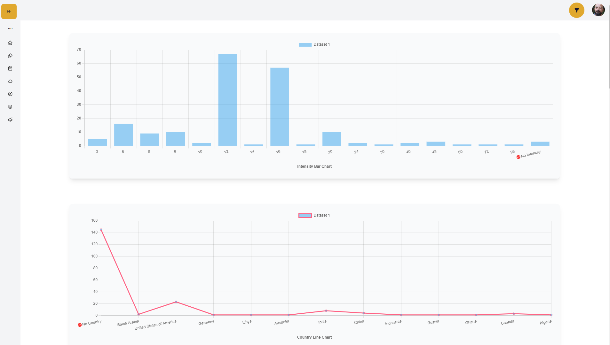
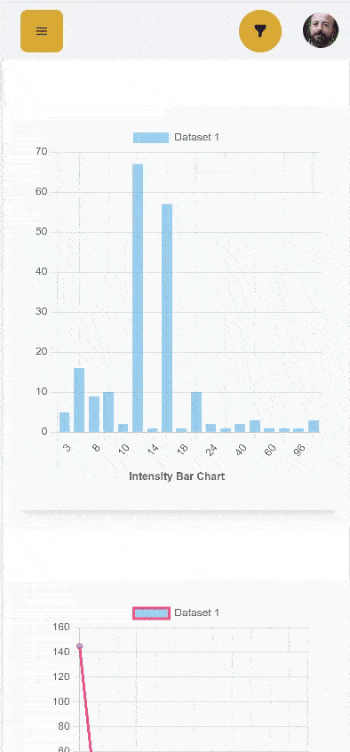

# Dashboard charts

Live Site link 👉 [Click Here](https://)

Server Github link 👉 [Click Here](https://)

#### About The site:

Getting data for dashboard and show multiple chats based on the data. using the api user can filter data.

### Desktop Screenshot



### Mobile Preview




### Technologies

- React
- DaisyUi
- ContextApi
- Axios
- react-query
- React icons
- Chart Js

### dependencies

```json
  "axios": "^0.27.2",
  "chart.js": "^3.8.0",
  "daisyui": "^2.15.2",
  "react": "^18.1.0",
  "react-chartjs-2": "^4.1.0",
  "react-dom": "^18.1.0",
  "react-icons": "^4.4.0",
  "react-query": "^3.39.1",
  "string-to-color": "^2.2.2",
```
